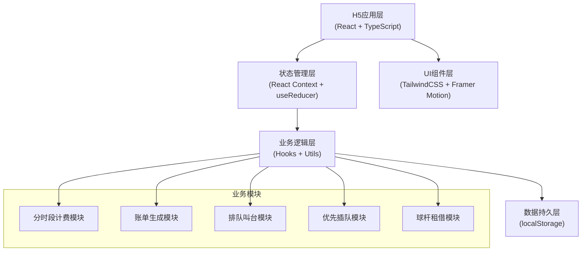
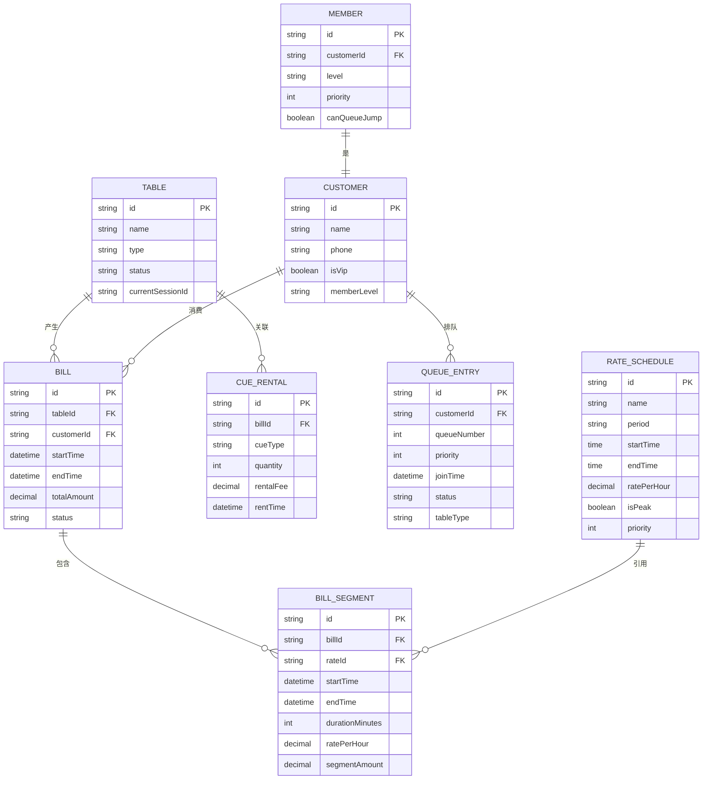

## 1. 架构设计

本系统采用纯前端架构，基于React + TypeScript构建单页应用，使用localStorage进行数据持久化，无需后端服务即可完整运行。



## 2. 技术描述

### 2.1 核心技术栈

| 层级 | 技术选型 | 版本 | 用途 |
|------|---------|------|------|
| 框架 | React | ^18.2.0 | UI构建框架 |
| 语言 | TypeScript | ^5.0.0 | 类型安全 |
| 构建工具 | Vite | ^5.0.0 | 快速构建与开发 |
| 样式 | TailwindCSS | ^3.4.0 | 原子化CSS框架 |
| 动画 | Framer Motion | ^11.0.0 | 流畅的动画效果 |
| 路由 | React Router DOM | ^6.20.0 | 单页路由管理 |
| 图标 | Lucide React | ^0.294.0 | 高质量图标库 |
| 状态管理 | React Context + useReducer | - | 轻量状态管理 |
| 日期处理 | date-fns | ^3.0.0 | 日期时间计算 |

### 2.2 目录结构

```
src/
├── components/          # 公共组件
│   ├── layout/         # 布局组件（Header, BottomNav）
│   ├── ui/             # 基础UI组件（Button, Card, Modal）
│   └── features/       # 业务组件（TableCard, QueueItem, BillItem）
├── contexts/           # 全局状态管理
│   ├── BillingContext.tsx    # 计费状态
│   ├── QueueContext.tsx      # 排队状态
│   └── MemberContext.tsx     # 会员状态
├── hooks/              # 自定义Hooks
│   ├── useBilling.ts   # 计费逻辑Hook
│   ├── useQueue.ts     # 排队逻辑Hook
│   └── useTimer.ts     # 计时器Hook
├── pages/              # 页面组件
│   ├── Dashboard.tsx   # 首页仪表盘
│   ├── TableManage.tsx # 球台管理
│   ├── RateConfig.tsx  # 费率配置
│   ├── QueueCall.tsx   # 排队叫台
│   ├── BillDetail.tsx  # 账单详情
│   └── MemberManage.tsx# 会员管理
├── utils/              # 工具函数
│   ├── billing.ts      # 计费计算工具
│   ├── time.ts         # 时间处理工具
│   └── storage.ts      # 本地存储工具
├── types/              # 类型定义
│   └── index.ts        # 全局类型
├── data/               # Mock数据
│   └── mockData.ts     # 初始数据
├── App.tsx             # 应用入口
├── main.tsx            # 渲染入口
└── index.css           # 全局样式
```

## 3. 路由定义

| 路由路径 | 页面名称 | 说明 |
|---------|---------|------|
| / | 首页仪表盘 | 实时状态概览 |
| /tables | 球台管理 | 球台列表、开台、计时计费 |
| /rates | 费率配置 | 时段费率表维护 |
| /queue | 排队叫台 | 取号、叫号、队列管理 |
| /bill/:id | 账单详情 | 消费明细、分段计费展示 |
| /members | 会员管理 | VIP会员信息、插队权限 |

## 4. 核心数据模型

### 4.1 ER图



### 4.2 关键类型定义

```typescript
// 时段费率
interface RateSchedule {
  id: string;
  name: string;           // 费率名称（如：高峰时段）
  period: 'peak' | 'normal' | 'night';  // 时段类型
  startTime: string;      // HH:mm 格式
  endTime: string;        // HH:mm 格式
  ratePerHour: number;    // 每小时费率
  isPeak: boolean;        // 是否高峰
  priority: number;       // 优先级（用于重叠时段）
}

// 球台
interface Table {
  id: string;
  name: string;           // 球台编号（如：A1, B2）
  type: 'american' | 'snooker'; // 球台类型
  status: 'available' | 'occupied' | 'maintenance';
  currentSessionId?: string;
}

// 计费会话
interface BillingSession {
  id: string;
  tableId: string;
  customerId: string;
  customerName: string;
  customerPhone: string;
  isVip: boolean;
  startTime: Date;
  endTime?: Date;
  status: 'active' | 'completed';
  cueRentals: CueRental[];
}

// 账单分段
interface BillSegment {
  id: string;
  rateName: string;
  ratePerHour: number;
  startTime: Date;
  endTime: Date;
  durationMinutes: number;
  amount: number;
}

// 账单
interface Bill {
  id: string;
  sessionId: string;
  tableName: string;
  customerName: string;
  startTime: Date;
  endTime: Date;
  totalDuration: number;
  segments: BillSegment[];
  cueRentalTotal: number;
  tableFeeTotal: number;
  totalAmount: number;
  vipDiscount?: number;
  finalAmount: number;
  createdAt: Date;
}

// 排队条目
interface QueueEntry {
  id: string;
  queueNumber: number;
  customerName: string;
  customerPhone: string;
  isVip: boolean;
  memberLevel: number;    // 会员等级（1-5）
  priority: number;       // 计算优先级
  tableType: 'american' | 'snooker' | 'any';
  joinTime: Date;
  status: 'waiting' | 'called' | 'completed' | 'cancelled';
  calledTime?: Date;
}

// 球杆租借
interface CueRental {
  id: string;
  type: 'standard' | 'professional' | 'carbon';
  name: string;
  quantity: number;
  feePerHour: number;
  totalFee: number;
}
```

### 4.3 核心算法说明

**1. 跨时段分段计费算法**
```
输入: startTime, endTime, rateSchedules[]
输出: segments[], totalAmount

1. 将费率按时段排序，处理重叠时段（按优先级）
2. 计算 startTime 到 endTime 之间经过的所有费率切换点
3. 按切换点拆分时间段
4. 对每个时间段匹配对应的费率
5. 计算每段金额 = 时长(小时) × 费率
6. 累加所有分段金额得到合计
```

**2. 优先级队列排序算法**
```
优先级计算公式:
priority = (isVip ? 1000 : 0) + (memberLevel * 100) - (waitMinutes * 0.5)

排序规则:
1. VIP会员优先（基础分1000）
2. 会员等级越高越优先（每级+100）
3. 等待时间越长优先级适当提升（每2分钟+1）
4. 同优先级按取号先后排序
```

**3. VIP插队处理逻辑**
```
当VIP取号时:
1. 计算VIP的优先级分数
2. 遍历当前队列，找到第一个优先级低于VIP的位置
3. 将VIP插入该位置之前
4. 通知该位置及之后的顾客位置变更
5. 更新队列展示，高亮新插入的VIP条目
```
