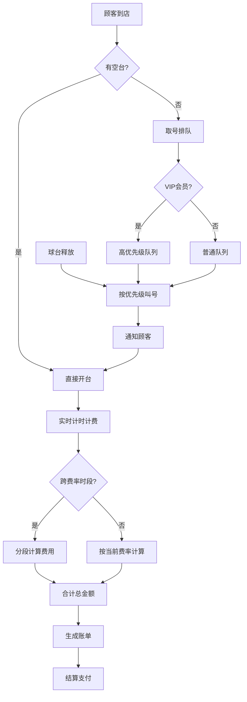

## 1. 产品概述

台球室计费叫台H5系统，为台球室提供智能化的时段计费、账单管理、排队叫台和VIP优先服务，解决高峰时段球台分配效率低、计费计算复杂、会员服务体验差等问题。

- 主要解决：分时段费率计算复杂易出错、高峰时段排队混乱、VIP会员权益无法体现、账单生成不透明等痛点
- 目标用户：台球室经营者、前台收银员、到店消费顾客（含VIP会员）
- 产品价值：提升运营效率30%以上，减少计费纠纷，优化顾客排队体验，提升VIP会员满意度

## 2. 核心 Features

### 2.1 用户角色

| 角色 | 身份识别方式 | 核心权限 |
|------|-------------|----------|
| 前台收银员 | 员工账号登录 | 费率配置、开台结账、叫台管理、租借登记 |
| 普通顾客 | 现场取号/扫码 | 查看排队状态、消费账单、球台信息 |
| VIP会员 | 手机号/会员卡号 | 优先排队、查看消费记录、会员权益 |

### 2.2 Feature Module

1. **分时段计费模块**：时段费率表维护、跨档时长拆分算法、分段金额合计
2. **账单生成模块**：实时费用计算、消费明细展示、账单打印/分享
3. **排队叫台模块**：取号排队、叫号通知、队列状态展示
4. **优先插队模块**：VIP会员识别、优先级队列维护、插队处理

### 2.3 Page Details

| 页面名称 | 模块名称 | 功能描述 |
|---------|---------|----------|
| 首页仪表盘 | 概览模块 | 实时球台状态、当前排队人数、今日营收统计 |
| 球台管理页 | 计费模块 | 球台列表、开台操作、实时计时计费、球杆租借登记 |
| 费率配置页 | 计费模块 | 时段费率表增删改查、高峰/平峰/夜间档位设置 |
| 排队叫台页 | 排队模块 | 取号登记、队列展示、叫台操作、历史叫台记录 |
| 账单详情页 | 账单模块 | 消费明细、分段计费展示、金额合计、结算操作 |
| 会员管理页 | 插队模块 | VIP会员列表、会员等级配置、插队权限管理 |

## 3. 核心流程

### 3.1 顾客消费流程
顾客到店 → 评估球台状态 → 如有空台直接开台 → 如无空台取号排队 → 叫台通知 → 开台消费 → 实时计时计费（跨时段自动分段）→ 结算生成账单 → 完成支付

### 3.2 跨时段计费流程
开始计时 → 检测费率切换点 → 到达切换点自动拆分时长 → 按对应费率计算各段金额 → 累计合计总金额 → 生成包含分段明细的账单

### 3.3 排队叫台流程
顾客取号 → 根据会员等级分配优先级 → 进入对应优先级队列 → 球台释放 → 按优先级从高到低叫号 → 通知顾客 → 确认就位开台

## 4. 用户界面设计

### 4.1 设计风格

**设计理念**：高端台球俱乐部风格，深色主题配合绿色系点缀（台球桌颜色），营造专业、现代的运动休闲氛围。

- **主色调**：深墨绿 `#0D3B2C` - 代表专业与沉稳，呼应台球桌颜色
- **辅助色**：金色 `#D4AF37` - 代表VIP尊贵感
- **强调色**：朱红 `#E63946` - 用于高峰提示、重要操作
- **中性色**：深灰 `#1A1A2E` / 浅灰 `#F5F5F5`
- **按钮风格**：圆角8px，微立体阴影，悬停有微妙上浮动画
- **字体**：标题使用「思源黑体 Bold」，正文使用「思源黑体 Regular」，数字使用等宽字体增强可读性
- **布局风格**：卡片式布局，清晰的信息层级，适当的留白
- **图标风格**：线性图标配合填充状态，运动休闲主题

### 4.2 页面设计概述

| 页面名称 | 模块名称 | UI Elements |
|---------|---------|-------------|
| 首页仪表盘 | 概览模块 | 顶部导航、状态统计卡片网格、球台状态分布图、实时排队列表、滚动动画展示叫号信息 |
| 球台管理页 | 计费模块 | 球台网格布局（绿/黄/红三色状态）、开台弹窗、实时计时器、球杆租借面板 |
| 费率配置页 | 计费模块 | 时间轴可视化费率时段、拖拽调整时段、费率输入表单、预览效果 |
| 排队叫台页 | 排队模块 | 双列队列展示（VIP/普通）、大号叫号显示区、叫号按钮动画、取号登记表单 |
| 账单详情页 | 账单模块 | 分段计费时间轴、费用明细列表、金额合计大字展示、支付方式选择 |
| 会员管理页 | 插队模块 | 会员卡片列表（金色边框VIP标识）、等级徽章、权限配置开关 |

### 4.3 响应式设计

- **设计原则**：Mobile-first，H5页面适配手机端为主，同时兼容平板
- **断点设置**：375px（手机）、768px（平板）、1024px（横屏/桌面）
- **触控优化**：按钮最小高度48px，点击区域足够大，列表项左滑删除操作
- **手势支持**：上下滑动浏览、左右滑动切换标签页、下拉刷新队列状态

### 4.4 动效设计

- **叫号动画**：叫号时大号数字从底部滑入，配合金色光晕脉冲效果
- **计时器动画**：秒针平滑转动，每分钟有轻微刻度跳动反馈
- **队列更新**：新顾客加入时卡片从右侧滑入，叫号完成时卡片向上滑出
- **金额计算**：金额变化时有数字滚动动画，增强视觉反馈
- **VIP插队**：VIP插入队列时有金色高亮闪烁，提示位置变化
